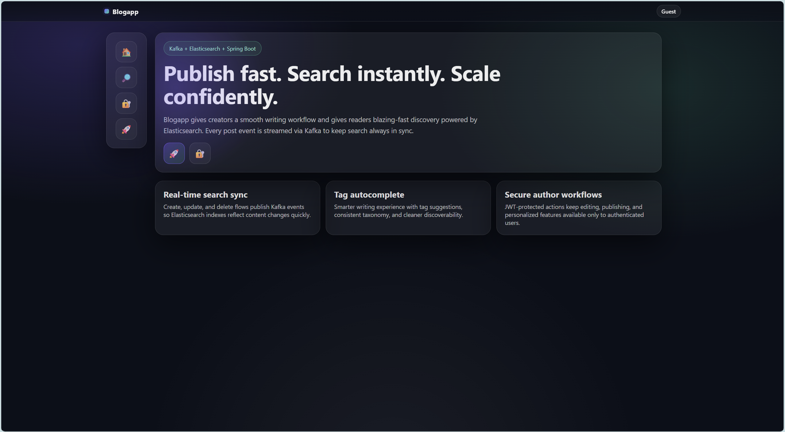
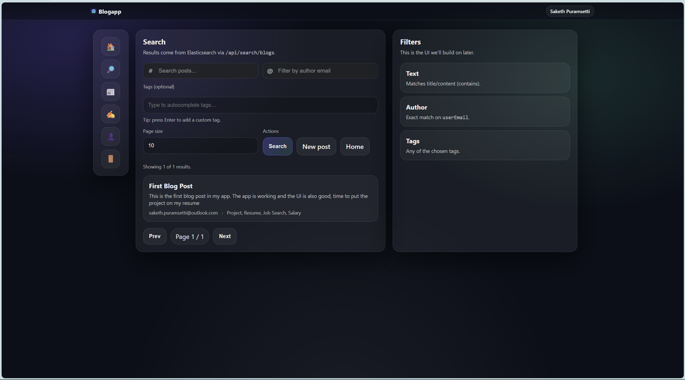
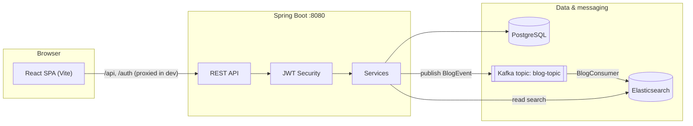

# Blogapp

> **100% vibe-coded** — built entirely with [Cursor](https://cursor.sh) and [GitHub Copilot](https://github.com/features/copilot). Every line of code was AI-assisted from architecture to deployment config.

A full-stack blog platform where **PostgreSQL** is the system of record, **Apache Kafka** streams blog lifecycle events, and **Elasticsearch** powers fast, filterable search. The UI is a **React + TypeScript** SPA served by **Vite**, talking to a **Spring Boot** REST API secured with **JWT**.

---

## Screenshots

### Home / Feed


### Search


---

## Architecture



### Responsibilities

| Layer | Role |
|-------|------|
| **PostgreSQL** | Users, blogs, tags — durable storage via JPA entities and repositories. |
| **Kafka** | Decouples the write path from search indexing. `BlogProducer` sends `BlogEvent` messages on create/update/delete. |
| **Elasticsearch** | Search index updated by `BlogConsumer`. `BlogSearchService` handles criteria queries for `/api/search/blogs`. |
| **Spring Boot** | REST controllers, business logic, security, Kafka producer/consumer. |
| **React** | Pages for home, auth, feed, editor, blog detail, search, and account — `fetch` to backend with `Authorization: Bearer`. |

### Event-driven search sync

1. User creates/updates/deletes a blog via `/api/blogs`.
2. `BlogService` persists changes in PostgreSQL and publishes a `BlogEvent` to Kafka (`blog-topic`).
3. `BlogConsumer` applies the event to Elasticsearch — `CREATED`/`UPDATED` → upsert, `DELETED` → remove by id.

> If Kafka or Elasticsearch is down, CRUD continues to work while search lags until the pipeline recovers.

---

## Tech Stack

| Layer | Technology |
|-------|-----------|
| Backend | Java 17, Spring Boot 4.x, Spring Data JPA, Spring Security, Spring Kafka, Spring Data Elasticsearch, JJWT, Lombok |
| Database | PostgreSQL 16 |
| Search | Elasticsearch 9.x (optional Kibana) |
| Messaging | Kafka + Zookeeper (Confluent images) |
| Frontend | React 18, TypeScript, React Router 7, Vite 5 |
| AI tooling | Cursor, GitHub Copilot |

---

## Repository Layout

```
blogapp/
├── src/main/java/com/blog/blogapp/   # Spring Boot application
│   ├── controller/                   # REST endpoints
│   ├── service/                      # Business logic
│   ├── entity/, repository/          # JPA
│   ├── kafka/                        # Producer & consumer
│   ├── elasticsearch/                # ES document & repository
│   ├── security/                     # JWT filter & token service
│   └── config/                       # Security, Kafka, Elasticsearch
├── src/main/resources/
│   └── application.properties        # Datasource, Kafka, ES, server config
├── frontend/                         # Vite + React SPA
│   ├── src/
│   │   ├── App.tsx                   # Shell, sidebar, routes
│   │   ├── pages/                    # Feature pages
│   │   └── lib/                      # api.ts, auth, storage
│   └── vite.config.ts                # Dev proxy → :8080
├── docker-compose.yml                # Postgres, Kafka, ES, Kibana
├── pom.xml
└── README.md
```

---

## API Overview

### Public (no JWT)

| Method | Path | Description |
|--------|------|-------------|
| POST | `/auth/register` | Register a new user. Returns success, message, email. Call `/auth/login` next. |
| POST | `/auth/login` | Login. Returns `AuthResponse` with JWT. |

### Authenticated (`Authorization: Bearer <token>`)

| Method | Path | Description |
|--------|------|-------------|
| GET/POST/PUT/DELETE | `/api/blogs`, `/api/blogs/{id}`, `/api/blogs/feed` | CRUD and random feed. |
| GET | `/api/search/blogs` | Query params: `q`, `userEmail`, `tags` (repeatable), `page`, `size`. |
| GET | `/api/tags`, `/api/tags/suggest` | Tag list and autocomplete. |
| GET/DELETE | `/api/users/me` | Profile and account deletion. |

Spring Security config: `/auth/**` is public; everything under `/api/**` requires a valid JWT.

---

## Configuration

Defaults live in `src/main/resources/application.properties`:

| Setting | Default |
|---------|---------|
| PostgreSQL | `localhost:5432`, db `blogdb`, user `bloguser` / `blogpass` |
| Kafka | `localhost:9092`, group `blog-group`, topic `blog-topic` |
| Elasticsearch | `http://localhost:9200` |
| Server | port `8080` |

Override via env vars, profile-specific properties, or local edits — don't commit secrets.

> **JWT:** Signing uses a hardcoded dev secret in `JwtService`. For production, move this to config or a secret manager and rotate keys.

---

## Prerequisites

- **JDK 17** + **Maven** (or use `./mvnw`)
- **Docker** + **Docker Compose** (for infrastructure)
- **Node.js 18+** + npm (for the frontend)

---

## Running Locally

### 1. Start infrastructure

```bash
docker compose up -d
```

| Service | Port | Notes |
|---------|------|-------|
| PostgreSQL | 5432 | `blogdb` |
| Kafka | 9092 | Advertised as `localhost:9092` |
| Elasticsearch | 9200 | Single-node, security disabled |
| Kibana | 5601 | Optional ES UI |
| Zookeeper | 2181 | Kafka dependency |

Wait for Postgres and Elasticsearch to be healthy before starting the app.

### 2. Run the backend

```bash
./mvnw spring-boot:run
```

Or build and run the JAR:

```bash
./mvnw package
java -jar target/*.jar
```

### 3. Run the frontend

```bash
cd frontend
npm install
npm run dev
```

Vite proxies `/api` and `/auth` to `http://localhost:8080`, so no CORS config is needed in development.

### 4. Open the app

Visit `http://localhost:5173`. Register or log in, then explore the feed, editor, search, and account pages.

---

## Production Notes

- Point `application.properties` (or env vars) at managed Postgres, Kafka, and Elasticsearch.
- Enable TLS and authentication for Elasticsearch; update Spring Elasticsearch client settings accordingly.
- Replace the JWT secret with a secure, configurable value. Consider shorter TTLs and a refresh token flow.
- Serve the built SPA from the same origin as the API, or configure CORS and absolute API URLs if you split hosts.

Build the frontend for static hosting:

```bash
cd frontend
npm run build
# Output: frontend/dist/
```

---

## Troubleshooting

**Search is empty or stale** — Confirm Kafka is running, the consumer is connected, and Elasticsearch is up. Posts created before the Kafka/ES pipeline was wired may need a reindex job (not included by default).

**401 on `/api/*`** — Make sure you're sending `Authorization: Bearer <token>` from the login response.

**DB connection errors** — Ensure `docker compose` Postgres is up and credentials match `application.properties`.

---

## License

See project metadata in `pom.xml`. Add a `LICENSE` file if you intend to open-source the repo.
