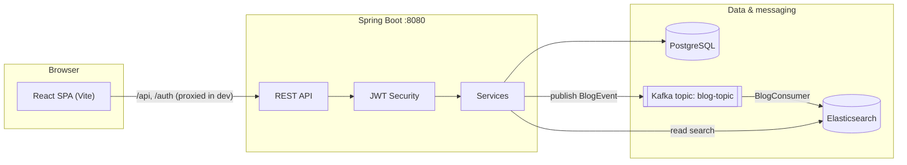

# Blogapp

A full-stack blog platform where **PostgreSQL** is the system of record, **Apache Kafka** streams blog lifecycle events, and **Elasticsearch** powers fast, filterable search. The UI is a **React + TypeScript** SPA served by **Vite**, talking to a **Spring Boot** REST API secured with **JWT**.

---

## Architecture



### Responsibilities

| Layer | Role |
|--------|------|
| **PostgreSQL** | Users, blogs, tags; durable storage; JPA entities and repositories. |
| **Kafka** | Decouples write path from search indexing. `BlogProducer` sends `BlogEvent` messages on create/update/delete. |
| **Elasticsearch** | Search index updated by `BlogConsumer`. `BlogSearchService` runs criteria queries for `/api/search/blogs`. |
| **Spring Boot** | REST controllers, business logic, security, Kafka producer/consumer. |
| **React** | Pages for home, auth, feed, editor, blog detail, search, account; `fetch` to backend with `Authorization: Bearer`. |

### Event-driven search sync

1. User creates/updates/deletes a blog via `/api/blogs`.
2. `BlogService` persists changes in PostgreSQL and sends a `BlogEvent` to Kafka (`blog-topic`).
3. `BlogConsumer` applies the event to Elasticsearch (`CREATED`/`UPDATED` → upsert document, `DELETED` → remove by id).

Search results reflect the index; if Kafka or Elasticsearch is down, the API may still work for CRUD while search lags or fails until the pipeline is healthy.

---

## Tech stack

- **Backend:** Java 17, Spring Boot 4.x, Spring Data JPA, Spring Security, Spring Kafka, Spring Data Elasticsearch, JJWT, Lombok  
- **Database:** PostgreSQL 16  
- **Search:** Elasticsearch 9.x (optional Kibana in Compose)  
- **Messaging:** Kafka + Zookeeper (Confluent images)  
- **Frontend:** React 18, TypeScript, React Router 7, Vite 5  

---

## Repository layout

```
blogapp/
├── src/main/java/com/blog/blogapp/   # Spring Boot application
│   ├── controller/                   # REST endpoints
│   ├── service/                      # Business logic
│   ├── entity/, repository/          # JPA
│   ├── kafka/                        # Producer & consumer
│   ├── elasticsearch/                # ES document & repository
│   ├── security/                     # JWT filter & token service
│   └── config/                       # Security, Kafka, Elasticsearch
├── src/main/resources/
│   └── application.properties        # Datasource, Kafka, ES, server
├── frontend/                         # Vite + React SPA
│   ├── src/
│   │   ├── App.tsx                   # Shell, sidebar, routes
│   │   ├── pages/                    # Feature pages
│   │   └── lib/                      # api.ts, auth, storage
│   └── vite.config.ts                # Dev proxy → :8080
├── docker-compose.yml                # Postgres, Kafka, ES, Kibana
├── pom.xml
└── README.md
```

---

## API overview

**Public (no JWT)**

| Method | Path | Description |
|--------|------|-------------|
| POST | `/auth/register` | Register; returns `RegisterResponse` (success, message, email). No JWT—clients typically call `/auth/login` next (as the SPA does). |
| POST | `/auth/login` | Login; returns `AuthResponse` with JWT. |

**Authenticated (`Authorization: Bearer <token>`)**

| Method | Path | Description |
|--------|------|-------------|
| GET/POST/PUT/DELETE | `/api/blogs`, `/api/blogs/{id}`, `/api/blogs/feed` | CRUD and random feed. |
| GET | `/api/search/blogs` | Query params: `q`, `userEmail`, `tags` (repeatable), `page`, `size`. |
| GET | `/api/tags`, `/api/tags/suggest` | Tag list and autocomplete. |
| GET/DELETE | `/api/users/me` | Profile and account deletion. |

Spring Security (`SecurityConfig`): `/auth/register` and `/auth/login` are permitted; `/api/**` requires authentication.

---

## Configuration

Defaults live in `src/main/resources/application.properties`:

- **PostgreSQL:** `localhost:5432`, database `blogdb`, user `bloguser` / `blogpass` (matches `docker-compose.yml`).
- **Kafka:** `localhost:9092`, consumer group `blog-group`, topic `blog-topic`.
- **Elasticsearch:** `http://localhost:9200`.
- **Server:** port `8080`.

Override any of these for your environment (env vars, profile-specific properties, or local edits—do not commit secrets).

**JWT:** Signing uses a hardcoded secret in `JwtService` for development. For production, move the secret to configuration or a secret manager and rotate keys properly.

---

## Prerequisites

- **JDK 17** and **Maven** (or use `./mvnw`).
- **Docker** and **Docker Compose** (for infrastructure).
- **Node.js 18+** and npm (for the frontend).

---

## Run locally

### 1. Start infrastructure

From the repo root:

```bash
docker compose up -d
```

This starts:

| Service | Port | Notes |
|---------|------|--------|
| PostgreSQL | 5432 | `blogdb` |
| Kafka | 9092 | Advertised as `localhost:9092` |
| Elasticsearch | 9200 | Single-node, security disabled for local dev |
| Kibana | 5601 | Optional UI for ES |
| Zookeeper | 2181 | Kafka dependency |

Wait until Postgres and Elasticsearch are healthy before starting the app.

### 2. Run the backend

```bash
./mvnw spring-boot:run
```

Or build and run the JAR from `target/` after `./mvnw package`.

### 3. Run the frontend

```bash
cd frontend
npm install
npm run dev
```

Vite dev server proxies `/api` and `/auth` to `http://localhost:8080` (see `frontend/vite.config.ts`), so the browser uses same-origin requests and cookies are not required for JWT (token is stored client-side—see `frontend/src/lib/storage.ts`).

### 4. Use the app

Open the URL Vite prints (typically `http://localhost:5173`). Register or log in, then use feed, editor, search, and account pages.

---

## Production-oriented notes

- Point `application.properties` (or env) at managed Postgres, Kafka, and Elasticsearch.
- Enable TLS and authentication for Elasticsearch in real deployments; update Spring Elasticsearch client settings accordingly.
- Replace the JWT secret with a secure, configurable value and consider shorter token TTLs and refresh flows if needed.
- Serve the built SPA from the same origin as the API or configure CORS and absolute API URLs if you split hosts.

Build the frontend for static hosting:

```bash
cd frontend
npm run build
```

Output is under `frontend/dist/`.

---

## Troubleshooting

- **Search empty or stale:** Confirm Kafka is running, the consumer is connected, and Elasticsearch is up. New posts emit events; existing DB rows before Kafka/ES was wired may need a reindex job (not included by default).
- **401 on `/api/*`:** Send `Authorization: Bearer <token>` from login/register response.
- **DB connection errors:** Ensure `docker compose` Postgres is up and credentials match `application.properties`.

---

## License

See project metadata in `pom.xml`. Add a `LICENSE` file if you intend to open-source the repo.
